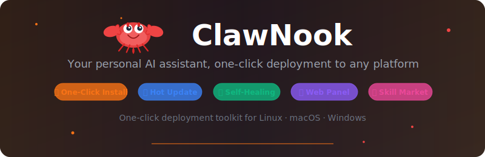

<p align="center">
  
</p>

<p align="center">
  <a href="https://github.com/cintia09/clawnook/releases"></a>
  <a href="LICENSE"></a>
  <a href="https://github.com/cintia09/clawnook/stargazers"></a>
</p>

<p align="center">
  <strong>Your personal AI assistant, one-click deployment to any platform.</strong>
</p>

<p align="center">
  <a href="README.zh-CN.md">中文</a> ·
  <a href="https://github.com/openclaw/openclaw">OpenClaw</a> ·
  <a href="#one-click-install">Install</a> ·
  <a href="https://docs.openclaw.ai">Docs</a>
</p>

---

**ClawNook** deploys [OpenClaw](https://github.com/openclaw/openclaw) (an open-source personal AI assistant) inside a Docker container and provides a Web management panel that greatly simplifies installation, configuration, and day-to-day operations.

Docker deployment ensures environment isolation and reproducibility — no dependency conflicts or system pollution, and the entire instance can be backed up, migrated, or restored along with its container. On top of that, the Web panel lets you handle the following without touching the command line:

- 🚀 **One-Click Install** — A single command completes image pull, container creation, Gateway startup, and HTTPS / domain configuration on Linux, macOS, and Windows
- 🎨 **Config Management** — Visual editor for all settings, automatic snapshot backups, and one-click export for migrating to a new environment
- 🧠 **Model Integration** — Built-in catalog of 50+ AI providers, online API validation, and encrypted key storage
- 🧩 **Skill Market** — Scan and install community skills from GitHub / GitLab / Gitee, with built-in security scanning
- 🔗 **Remote Nodes** — Token-based pairing for remote devices, with a unified view of all connected nodes in the panel
- 💬 **Messaging Platforms** — Visual configuration for Feishu and other popular IM & social platforms, each with step-by-step setup guides
- 📊 **Dashboard & Logs** — Real-time Gateway / Web / Caddy status and resource monitoring, with multi-source log viewer
- 💻 **Browser Terminal** — Built-in WebSocket terminal for managing the container without SSH
- 🛡️ **Self-Healing** — Gateway Watchdog health monitoring, automatic crash recovery, and surgical config repair from snapshots

<p align="center">
  
</p>

<p align="center">
  
</p>

## One-Click Install

### Linux / macOS

```bash
curl -fsSL https://raw.githubusercontent.com/cintia09/clawnook/main/install.sh | bash
```

### Windows (Administrator PowerShell)

Windows installation currently uses the Docker Desktop approach only.
Please install and start Docker Desktop first, then run the install command below.

```powershell
irm https://raw.githubusercontent.com/cintia09/clawnook/main/install-windows-bootstrap.ps1 | iex
```

Or download and run `install-windows.bat` as Administrator.

## Local Install (Offline)

If you have limited internet access or prefer offline installation, download both the **source code** and the **Docker image** (`clawnook-image-lite.tar.gz`) from the [Releases](https://github.com/cintia09/clawnook/releases) page.

### Linux / macOS

```bash
tar xzf clawnook-*.tar.gz
cp clawnook-image-lite.tar.gz clawnook-*/
cd clawnook-*
bash install-imageonly.sh
```

### Windows (Administrator PowerShell)

```powershell
Expand-Archive clawnook-*.zip -DestinationPath .
Copy-Item clawnook-image-lite.tar.gz -Destination clawnook-*\
cd clawnook-*
powershell -ExecutionPolicy Bypass -File install-windows.ps1
```

> The install script auto-detects the local image and skips downloading. The full interactive setup (ports, HTTPS, domain, etc.) runs as normal.

## License

[MIT](LICENSE)
