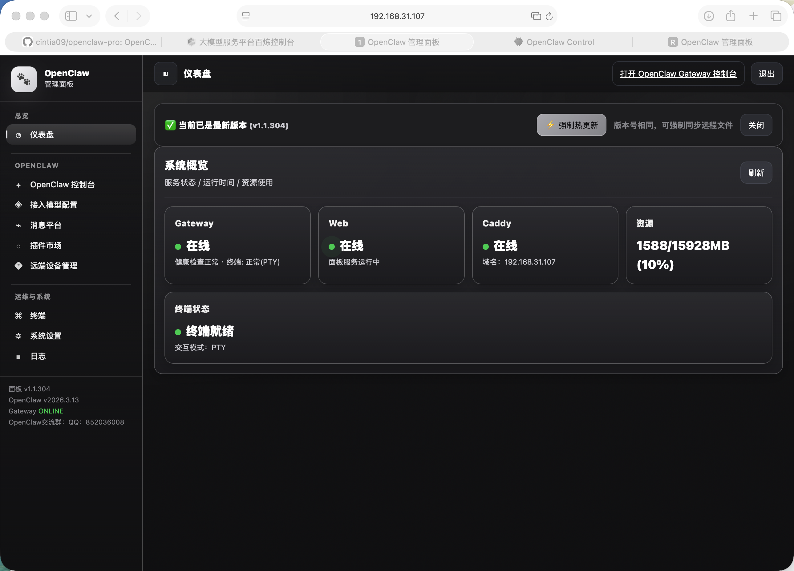
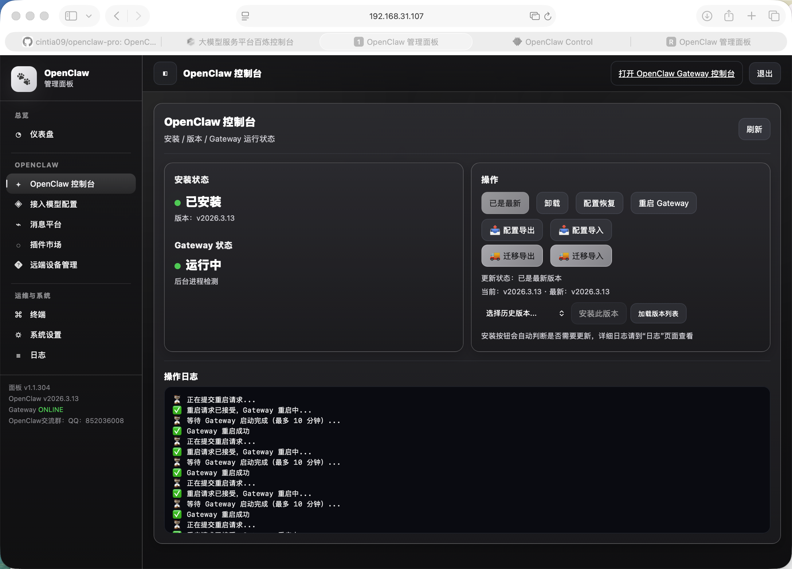

<p align="center">
  
</p>

<p align="center">
  <a href="https://github.com/cintia09/clawnook/releases"></a>
  <a href="LICENSE"></a>
  <a href="https://github.com/cintia09/clawnook/stargazers"></a>
</p>

<p align="center">
  <strong>你的私人 AI 助手，一键部署到任何平台。</strong>
</p>

<p align="center">
  <a href="README.md">English</a> ·
  <a href="https://github.com/openclaw/openclaw">OpenClaw</a> ·
  <a href="#一键安装">安装</a> ·
  <a href="#截图">截图</a> ·
  <a href="https://docs.openclaw.ai">文档</a>
</p>

---

**ClawNook** 通过 Docker 容器化部署 [OpenClaw](https://github.com/openclaw/openclaw)（开源个人 AI 助手），并提供 Web 管理面板，大幅简化安装、配置与日常运维。

Docker 部署带来环境隔离与一致性保证——无需担心依赖冲突或系统污染，整个实例可随容器一键备份、迁移或还原。在此基础上，Web 管理面板让以下操作无需命令行即可完成：

- 🚀 **一键安装** — 一条命令完成镜像拉取、容器创建、Gateway 启动与 HTTPS / 域名配置，支持 Linux、macOS、Windows
- 🎨 **配置管理** — 可视化编辑所有配置项，自动快照备份，支持一键导出迁移到新环境
- 🧠 **模型接入** — 内置 50+ AI 厂商目录，在线验证 API 可用性，密钥加密存储
- 🧩 **技能市场** — 从 GitHub / GitLab / Gitee 扫描安装社区技能包，内置安全扫描
- 🔗 **远程节点** — Token 配对连接远程设备，面板统一查看和管理所有已接入节点
- 💬 **消息平台** — 可视化配置飞书及多种主流即时通讯与社交平台接入，每个平台附带操作指引
- 📊 **仪表盘与日志** — 实时查看 Gateway / Web / Caddy 状态与资源占用，多来源日志在线浏览
- 💻 **浏览器终端** — 内置 WebSocket 终端，无需 SSH 即可管理容器
- 🛡️ **自愈运维** — Gateway Watchdog 健康监控、崩溃自动重启、配置异常从快照精准修复

<p align="center">
  
</p>

## 截图

<details open>
<summary><b>📸 Web 控制面板一览（点击展开/收起）</b></summary>
<br/>

<table>
  <tr>
    <td></td>
    <td></td>
  </tr>
</table>

</details>

## 一键安装

### Linux / macOS

```bash
curl -fsSL https://raw.githubusercontent.com/cintia09/clawnook/main/install.sh | bash
```

### Windows（管理员 PowerShell）

Windows 安装当前仅保留 Docker Desktop 方案。
请先安装并启动 Docker Desktop，再执行下面的安装命令。

```powershell
irm https://raw.githubusercontent.com/cintia09/clawnook/main/install-windows-bootstrap.ps1 | iex
```

或下载后以管理员身份运行 `install-windows.bat`。

## 本地安装（离线）

如果网络受限或希望离线安装，可从 [Releases](https://github.com/cintia09/clawnook/releases) 页面同时下载**源码包**和 **Docker 镜像**（`clawnook-image-lite.tar.gz`）。

### Linux / macOS

```bash
tar xzf clawnook-*.tar.gz
cp clawnook-image-lite.tar.gz clawnook-*/
cd clawnook-*
bash install-imageonly.sh
```

### Windows（管理员 PowerShell）

```powershell
Expand-Archive clawnook-*.zip -DestinationPath .
Copy-Item clawnook-image-lite.tar.gz -Destination clawnook-*\
cd clawnook-*
powershell -ExecutionPolicy Bypass -File install-windows.ps1
```

> 安装脚本会自动检测本地镜像文件并跳过下载，端口、HTTPS、域名等交互式配置流程与一键安装完全一致。

## 许可证

[MIT](LICENSE)
